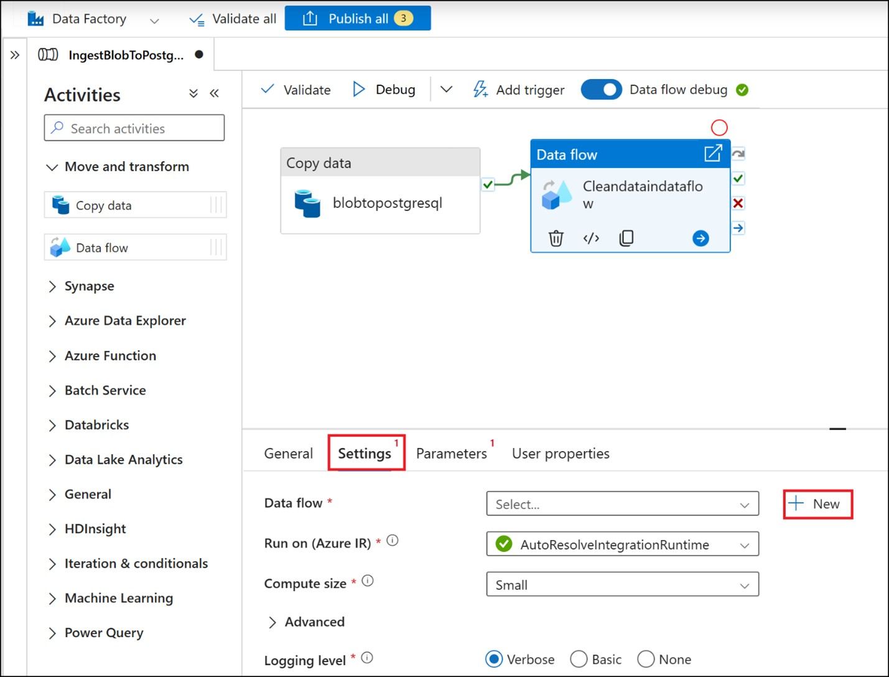
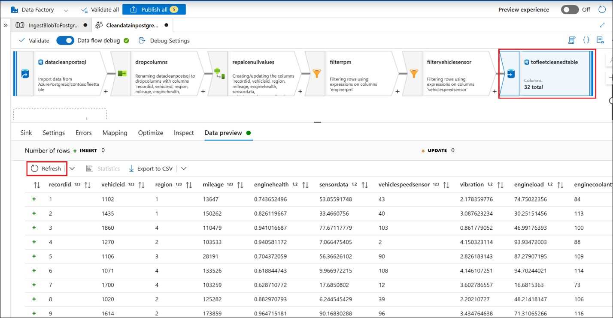
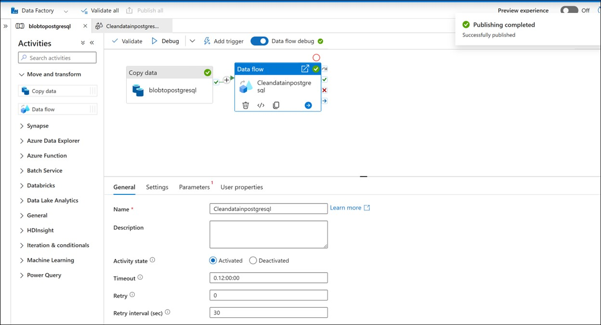

# Challenge 3 - Data Cleaning with Azure Data Factory

**Objective**  

Use ADF pipeline to clean and transform fleet data and load into fleet_cleaned_data.

**Steps:**

### Task 1 : PostgreSQL connection in ADF

1.  Create Azure PostgreSQL connection in ADF studio linked service and
    **Test Connection** to verify .Create with below details.

- **Name**: +++PostgreSQLLinkedService+++

- **Server Name**: Select your PostgreSQL server name (e.g.,
  \<yourserver\>.postgres.database.azure.com).

- Version : 1.0

- **Database Name**: **flexibleserverdb**.

- **Authentication**: Provide the username and password.(**citus** –
  +++Fhtest208+++

- **Encryption Method** : **SSL**

### Task 2 : Create a Pipeline and Dataflow to Transfer Data

1.  Create pipeline with the name – +++IngestBlobToPostgreSQL+++

    - Create Copy data action with the name : **blobtopostgresql**

    - Source data set (New) – Azure blob storage with **Delimited text**
      and set below properties

      - Name : +++blobfleetdata+++

      - Linked service – Azure blob linked service

      - File path -\>Container-\> Directory-\> File path-\>
        **fleetdata** folder-\> **fleet_data.csv** file

    - Create new Sink dataset –

- Name : +++AzurePostgreSqlcontosofleettable+++

- Linked Service : **PostgreSQLLinkedService**

  - Table name : Search for +++public.contosofleet++ and select it.

  &nbsp;

  - Import data in Mapping tab

  - Load from Blob to staging table

2.  Add Data flow to the Copy data action(blobtopostgresql) and name the
    dataflow – **Cleandataindataflow** and select new data flow and
    create it as per below requirements

    
    
### Task 3 : Create Data Flow

1.  Name the data flow – **Cleandatainpostgresqldataflow** and output
    stream **datacleanpostsql**

2.  Turn on **Data flow debug**

3.  Add **Select** action with below details

- **Output stream name**– +++dropcolumns+++

- Delete **MeasurementTimestamp , fleetid, truckid** columns

4.  Add **Derived Column action with below details**

- Output stream name as – **repalcenullvalues**

- Add below columns and expression in **Open expression builder.**

- **Save and finish**

  |Column Name|Expression|
  |--|--|
  |+++enginecoolanttemp+++|+++coalesce(toInteger(enginecoolanttemp), 25)+++|
  |+++ambientairtemp+++|+++coalesce(toInteger(ambientairtemp), 25)+++|
  |+++intakeairtemp+++|+++coalesce(toInteger(intakeairtemp), 25)+++|
  |+++enginerpm+++|+++coalesce(toInteger(enginerpm), 800)+++|
  |+++vehiclespeedsensor+++|+++coalesce(toInteger(vehiclespeedsensor), 0)+++|

5.  Add **Filter** action next to **repalcenullvalues**

    - output stream name – +++filterrpm+++

    - Filter on - +++enginerpm>=500&&enginerpm<=6000+++

6.  Add another Filter action next to **filterrpm** with below details

    - Output stream name – +++filtervehiclesensor+++

    - **Filter on** - +++vehiclespeedsensor >= 0 && vehiclespeedsensor <=200+++

7.  Add **Sink** action next to the **filtervehiclesensor** with below
    details

    - Output stream name – +++tofleetcleanedtable+++

    - **Dataset -New –**

      - Name : +++cleandatatoPostgreSqlTable+++

      - Linked Service : **PostgreSQLLinkedService**

      - Table name : Search for +++public.fleet_cleaned_data+++ and select it
        
      

### Task 4 : validate and debug pipeline

1.  **Validate** the flow

2.  **Debug** and **publish** the flow

  

**Success Criteria:**

- Mapping should have data imported successfully

- Flow validation should pass

- Pipeline should run successfully

- Data shows cleaned values in the destination table
