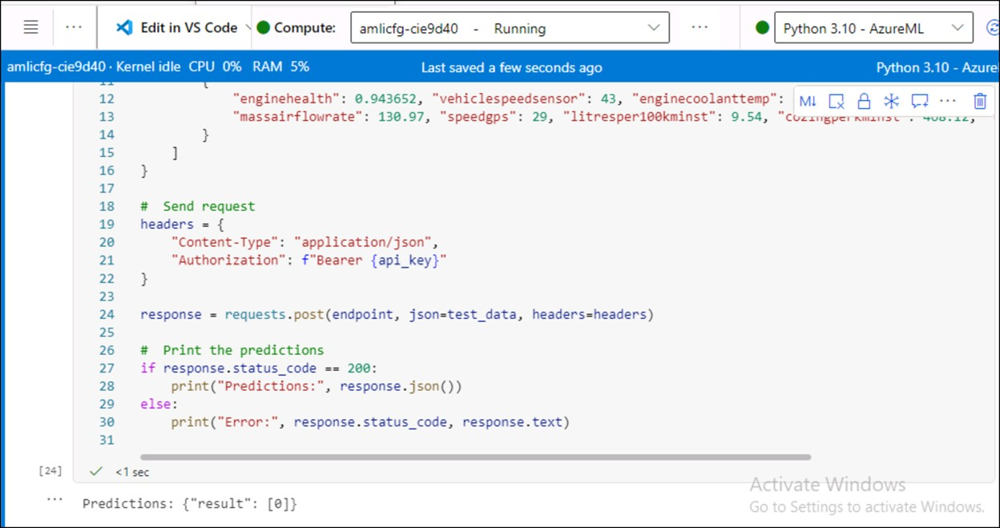

# Challenge 4- Train and Deploy the Model via Azure ML Studio

**Objective**

Run the notebook to train a model to predict maintenance flag and deploy
it to an endpoint.

**Steps:**

1.  Open AML Studio

2.Clone the GitHub repo in Coputer instance terminal:

+++git clone https://github.com/technofocus-pte/TFFleetOptmztn.git+++

3.  Open **fleet_model_train.ipynb** from Notebooks section and run as per instructions in notebook

4.  Train model using fleet_cleaned_data

5.  Deploy the model

**Success Criteria:**

- maintenance_model endpoint deployed and active

- Predictions should disply

