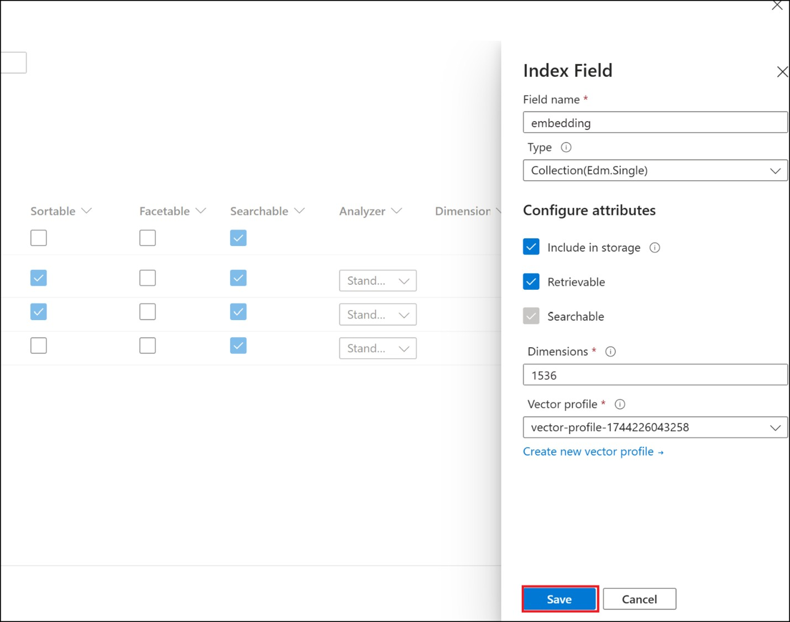
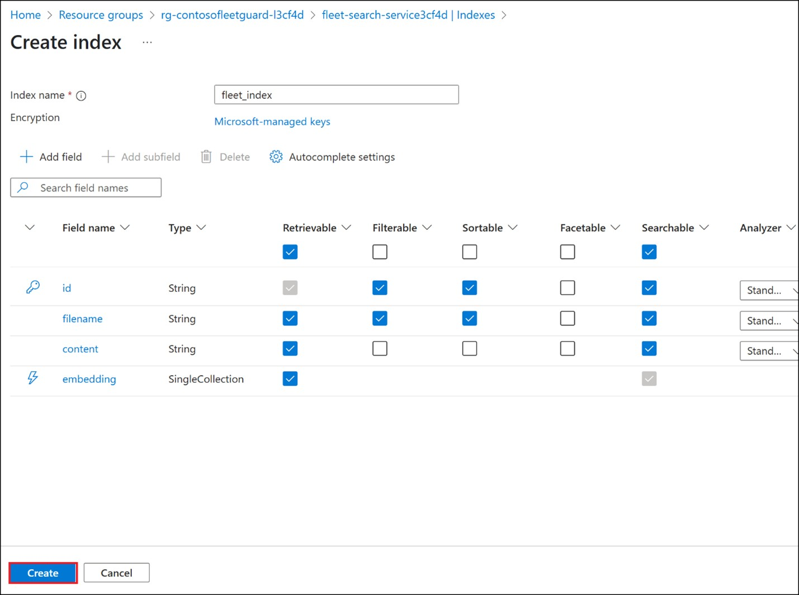
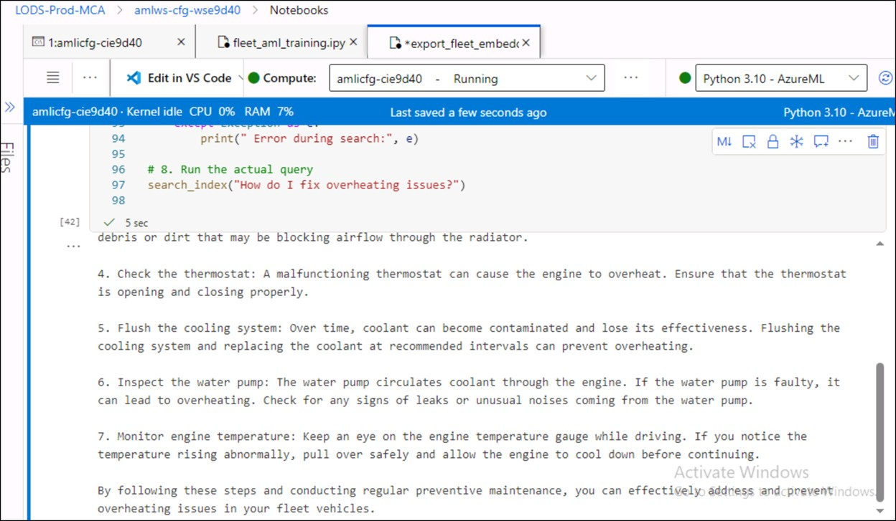

# Challenge 5- Generate Embeddings and export them to Azure Search

**Objective**

Use OpenAI to generate embeddings from documents and export to Azure
Search.

**Steps:**

## Task 1 : Configure settings in Azure AI search service

1.  On Identity setting in Azure Search service

2.  Select API Access control to Yes under **Keys** section.

## Task 2 : Create index

1.  Add index with the name - **fleet_index** in Azure search service

2.  Add below fields

|Field Name|Data Type|Searchable|Filterable|Sortable|Facetable|Retrievable|Dimensions|
|--|--|--|--|--|--|--|--|
|+++filename++|Edm.String|Yes|Yes|Yes|No|Yes||
|+++content+++|Edm.String|Yes|No|No|No|Yes||
|+++embedding++|Collection(Edm.Single)|Yes|No|No|No|Yes|+++1536+++|

3.  Save vector profile with default values

5.  Save Vector Algorithm with default values and then save Index field
    with Dimensions -1536 and default vector profile

   
   
   

## Task 3 : Deploy Chat- completion and embedding model.

1.  In Azure OpenAI-\> Azure AI Foundry:

    - Deploy base model -**text-embedding-ada-002** -customize -
      **Increase Tokens per Minute Rate Limit to max tokens**

    - Deploy base model - **gpt-35-turbo** -customize - **Increase
      Tokens per Minute Rate Limit to max tokens**

     
## Task 4 : Export embeddings to Azure AI search.

1.  Open **export_embeddings_to_search.ipynb** from notebooks . Update .evn cell and  run cells to
    export embeddings to search index.

    

**Success Criteria:**

- Search index should have created successfully.

- Index is populated with document content + embedding vectors
