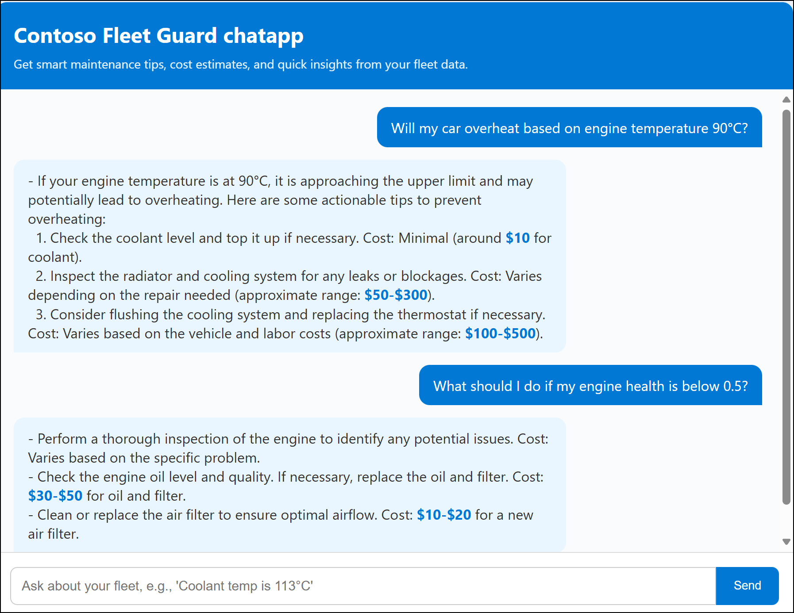

# Challenge 7: Deploy Azure AI Fleet Guard Chat App

**Objective**

Deploy Azure AI Fleet Guard app as Web app in Azure.

**Steps:**

1.  Install **Azure Developer CLI**  and **Azure App Service** extension  in VS code

2.  Sign in with your azure subscription in VS code

3.  Right click on App Service and create web app with below data
    - App name : +++fleetguard@lab.labInstance.Id+++
    - Region : Central US/West US/East US2
    - Python : 3.10
    - Plan :Basic

9.  Right click on chatapp folder and select **Deploy to Azure** to deploy the chat app as Web app in Azure.

10.  Open fleetguard from **App service** in Azure portal, web app add below environment variables.

|||
|--|--|
|**Variable**|**value**|
|+++FLASK_APP+++|+++app.py+++|
|+++WEBSITES_PORT+++|+++8000+++|

6.  Add **startup command** as +++python -m flask run --host=0.0.0.0 --port=8000+++ in configuration section of the app.

7.  Add **Microsoft** as **identity provider** with **application-read and write** permissions

8.  Set System assigned identity **ON**

9. Open Default domain url form Web app's Overview page and check the response of the app with below prompts.

+++Vehicle 98765 has an engine health of 82.6%. Coolant temperature is high (113°C)+++

+++my vehicle - 98765 has enginehealth - 0.826120+++

+++Predict maintenance issues for my vehicle with 80,000 km mileage+++

+++Will my car overheat based on engine temperature 90°C?+++

+++vehicle 24353 's enginehealth is 0.9 and vehicle sensor speed is 101+++

+++What should I do if my engine health is below 0.5?+++

+++What are 3 signs my fleet needs urgent servicing?+++

### **Success Criteria:**- App should respond with correct tips and cost for the prompt
